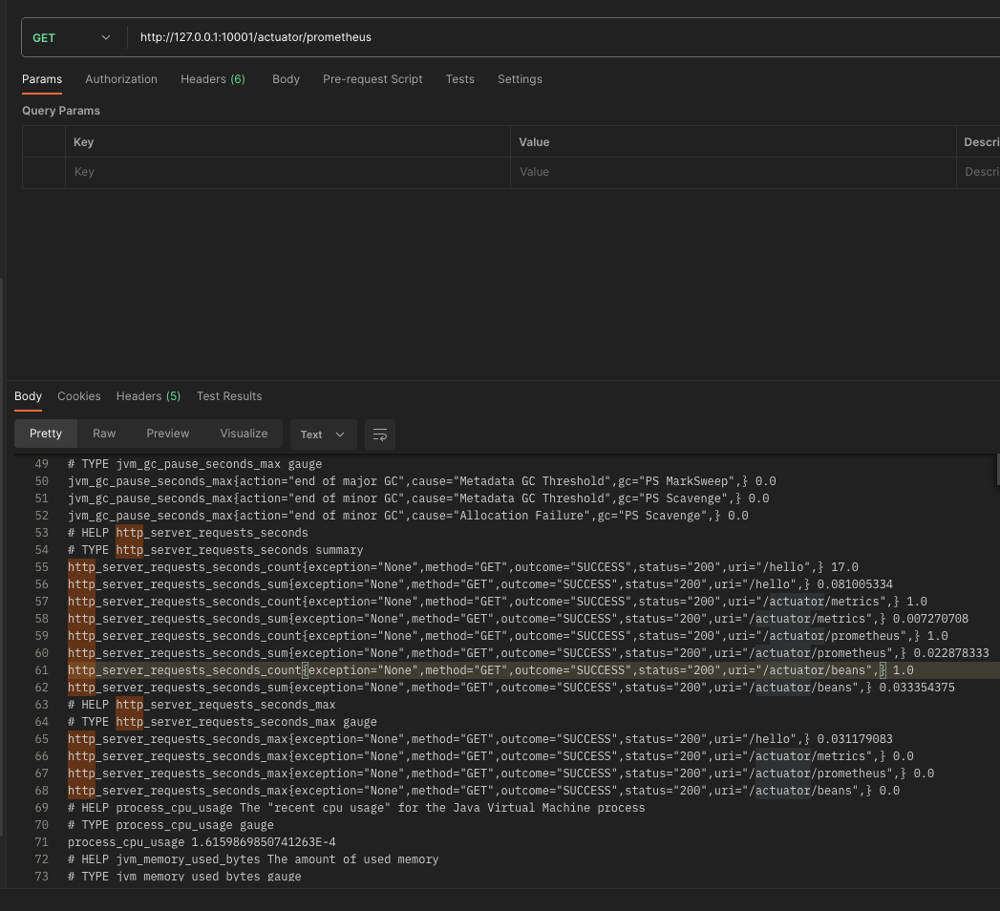

## 一、应用集成

1. Dependency
   ```xml
       <dependencies>
           <dependency>
               <groupId>io.micrometer</groupId>
               <artifactId>micrometer-core</artifactId>
           </dependency>
   
           <dependency>
               <groupId>io.micrometer</groupId>
               <artifactId>micrometer-registry-prometheus</artifactId>
           </dependency>
   
           <dependency>
               <groupId>org.springframework.boot</groupId>
               <artifactId>spring-boot-starter-actuator</artifactId>
           </dependency>
   ```

2. 暴露 Endpoint

   ```yaml
   management:
     endpoints:
       web:
         exposure:
           include: '*'
     endpoint:
       metrics:
         enabled: true
   ```

3. Check Prometheus Endpoint

   - URL:http://127.0.0.1:10001/actuator/prometheus - Prometheus Sever 同样也是通过此 API 获取指标数据
   - 

   

## 二、指标类型认识

- Counter
  - 累积
  - 特点：单向递增
  - Metrics Name：<base_name>_total
- Gauge
  - 单值
  - 特点：可下 可上
  - Metrics Name：<base_name>
- Histogram
  - 直方图
  - 特点：数据分布于 bucket 中
  - Metrics Name
    - <base_name>_sum 样本值之和
    - <base_name>_count 样本总数量
- Summary
  - 摘要
  - 特点：客户端计算出分位值
  - Metrics Name
    - <base_name>_sum 样本值之和
    - <base_name>_count 样本总数量

## 三、 PromQL

1. `sum()` - 聚合
2. `rate()` - 每秒平均增长率
3. `increase()` - 增量(可能是根据rate()估算得到的)
4. `irate()` - 解决长尾问题